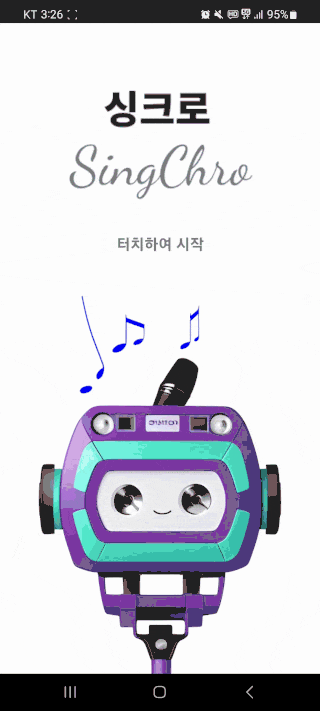
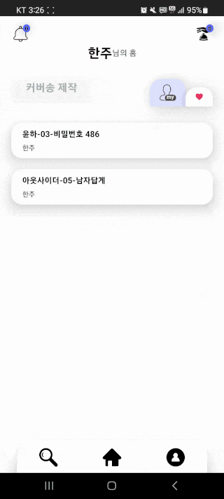
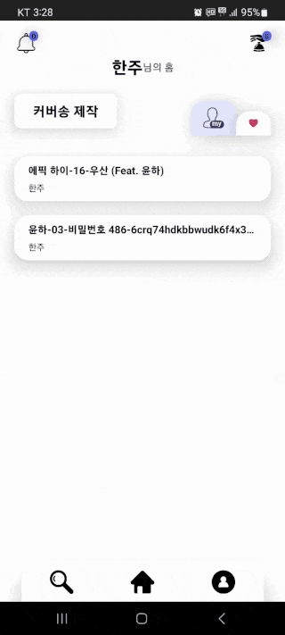
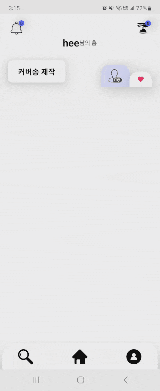
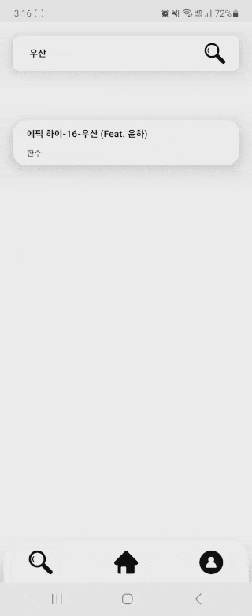
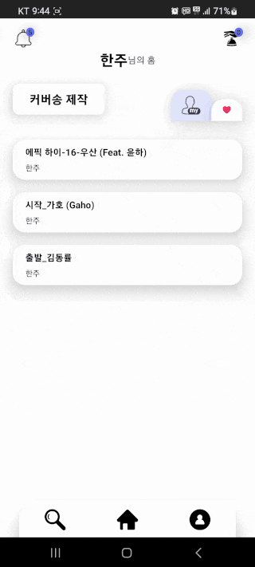
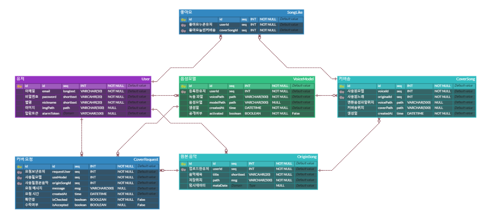
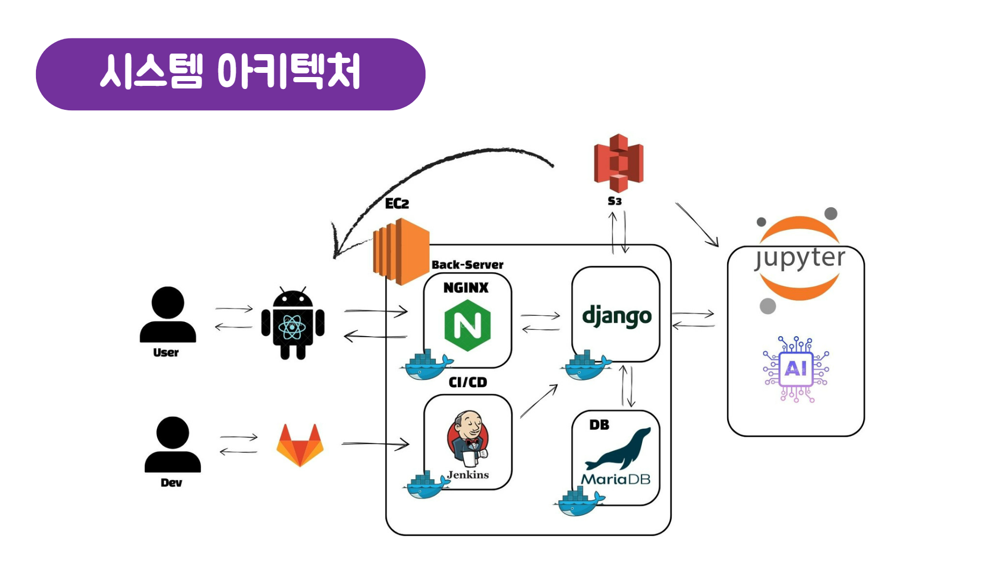

# 🎙️ 404_Found - SSAFY 9기 특화프로젝트

## **0️⃣ 프로젝트 개요**

🎈 프로젝트명 : 싱크로(SingChro)

📌 프로젝트 컨셉 : 생성형 AI를 이용해 사용자의 목소리로 커버송 만드는 모바일 어플리케이션

🛠 개발 기간 : 23.08.28 ~ 2310.06 (6주)

🧑🏻 팀원 : 손세이, 류병민, 하제우, 김한주, 채문희

💻 사용 기술스택 : Django, React-Native, AWS + (4. 시스템 아키텍처 참고)

<br>

## **1️⃣ 팀원 정보 및 업무 분담 내역**

| 이름            | 역할     | 설명                                                        |
| --------------- | -------- | ------------------------------------------------------------ |
| 손세이 (팀장) | AI | vocalRemover 코드 구현(원본 음원의 voice와 mr 분리)<br>최종 커버송 만드는 inference 코드를 구조에 맞게 수정 및 구현 |
| 류병민 | AI & CI/CD | AI 모델 학습 파이프라인 구축<br>CI/CD 설정 및 관리 |
| 하제우 | AI & CI/CD | 젠킨스 설정 및 스크립트 작성<br>Jupyter 서버와 EC2 서버간 통신<br>발표 |
| 김한주 | Frontend | React-Native를 통한 모바일 어플리케이션 개발<br>Recoil을 통한 상태관리<br> Firebase를 통한 모바일 푸쉬 알람 구현<br> 음악 플레이어 기능 구현<br> 안드로이드 버전에 따른 권한 허용 분기 처리 |
| 채문희 | Backend & CI/CD | Django Rest Framwork를 사용한 백엔드 개발<br>DockerFile, Docker-ComposeFile 작성 |
<br>

## **2️⃣ 서비스 대표 기능**

| 기능               | 세부기능                                                     |
| ------------------ | ------------------------------------------------------------ |
| 회원기능 | 이메일 인증을 통한 회원가입, 회원정보 변경, 회원 탈퇴 |
| 사용자 목소리 학습 | 사용자의 목소리를 녹음 후, 녹음 파일을 통해 목소리 모델 생성 |
| 커버송 생성 | 사용자가 업로드한 mp3 파일과 생성된 목소리 모델로 커버송 생성 |
| 커버송 검색 기능 | 타 사용자가 생성한 커버송 제목으로 검색 가능 |
| 커버송 요청 | 타 사용자에게 내가 원하는 노래 커버 요청 가능 |
| 커버송 좋아요 | 커버송에 좋아요를 눌러 좋아요 플레이리스트에 추가 가능 |
| 음악 플레이어 | 생성한 커버송을 앱 내에서 재생 가능 |
| 재생 플레이리스트 | 내가 생성한 커버송이나 좋아요 누른 노래로 플레이리스트가 구성됨<br>이전 곡, 다음곡, 반복 옵션, 리스트 셔플 가능 |
| 푸쉬 알람 | 모델 생성 완료, 커버송 생성 완료, 커버 요청 수락 및 거절 알람 기능 |
| 목소리 모델 관리 | 생성된 목소리 AI 모델 활성화 및 삭제 |
| 커버송 관리 | 생성된 커버송 삭제 |

<br>

## 3️⃣ 서비스 화면

<h4>모델 만들기</h4>



<h4>커버송 만들기</h4>



<h4>커버송 듣기</h4>



<h4>커버송 검색</h4>



<h4>커버송 요청</h4>



<h4>푸쉬 알람</h4>



<br>

## **4️⃣ ERD**



<br>

## **5️⃣ 시스템 아키텍쳐**



<br>

## **6️⃣ 개발 환경**

<h4>🌐 공통</h4>

| 상세               |       내용        |
| ------------------ | :---------------: |
| GitLab             |     형상 관리     |
| Jira               | 일정 및 이슈 관리 |
| Mattermost         |   커뮤니케이션    |
| Confluence             | 일정 및 문서 관리 |
| Figma           | 디자인 |
| Premiere pro           | UCC 제작 |
| Visual Studio Code | IDE |

<h4>📱 FrontEnd</h4>

| 상세             |  버전   |
| ---------------- | :-----: |
| Node.js | 18.17.0 |
| React-Native |  0.76.7  |
| TypeScript |  5.1.6  |
| Android SDK |  21~  |
| Java | 11.0 |
| Kotlin | 1.9.0 |
| Recoil | 0.7.7 |
| react-native-audio-recorder-player | 3.5.4 |
| react-native-firebase | 18.4.0 |

<h4>💾 BackEnd Server</h4>

| 상세           |    버전     |
| :------------- | :---------: |
| AWS S3 | |
| AWS EC2 Ubuntu | 20.04 LTS |
| Docker | 24.0.6 |
| NGINX | 1.25.2 |
| django | 4.2.5 |
| MariaDB | 11.1.2 |
| certbot | 2.7.0 |
| uwsgi | 2.0.22 |
| Jenkins | 2.141.1 |
| Docker-compose |   2.20.2    |
| PyCharm | 2023.2.1 |

<h4>🤖 AI Learning Server</h4>

| 상세           |    버전     |
| :------------- | :---------: |
| AWS EC2 Ubuntu | 20.04 LTS |
| Python | 3.9.7 |
| CUDA | 12.1 |
| pytorch | 2.0.0+cu118 |
| pytorch-lightning | 2.0.9 |
| vim | 8.1.3741 |

<br>

## **7️⃣ 프로젝트 디렉토리 구조**

### Front
```
SingChro
├── App.tsx
...
└── src
    ├── assets
    │   ├── icon
            └──...
    │   └── images
            └──...
    ├── components
    │   ├── Auth
    │   │   └── AuthSide.tsx
    │   ├── Cover
    │   │   ├── NewSongList.tsx
    │   │   ├── NewSongModal.tsx
    │   │   ├── OldSongList.tsx
    │   │   ├── OldSongModal.tsx
    │   │   ├── PickedSongItem.tsx
    │   │   ├── PickedVoiceItem.tsx
    │   │   ├── VoiceList.tsx
    │   │   └── VoiceModal.tsx
    │   ├── Footer
    │   │   └── BottomBar.tsx
    │   ├── Header
    │   │   ├── AlarmListItem.tsx
    │   │   ├── AlarmModal.tsx
    │   │   ├── NameHeader.tsx
    │   │   ├── RequestListItem.tsx
    │   │   └── RequestModal.tsx
    │   ├── Home
    │   │   └── FilterBtn.tsx
    │   ├── Player
    │   │   ├── BtnBox.tsx
    │   │   ├── ImgBox.tsx
    │   │   └── PlayController.tsx
    │   ├── Profile
    │   │   ├── ChangeNameModal.tsx
    │   │   ├── ChangePwModal.tsx
    │   │   ├── CoverManageList.tsx
    │   │   ├── CoverManageModal.tsx
    │   │   ├── DeleteUserModal.tsx
    │   │   ├── VoiceManageList.tsx
    │   │   └── VoiceManageModal.tsx
    │   ├── Record
    │   │   ├── GuideBox.tsx
    │   │   ├── PlayBox.tsx
    │   │   └── RecordBox.tsx
    │   └── shared
    │       ├── AuthInput.tsx
    │       ├── Badge.tsx
    │       ├── CommonModal.tsx
    │       ├── CoverItem.tsx
    │       ├── FunctionBtn.tsx
    │       ├── Loading.tsx
    │       ├── MascotBg.tsx
    │       ├── MascotBottom.tsx
    │       ├── RectangleBtn.tsx
    │       ├── RoundBtn.tsx
    │       ├── SearchInput.tsx
    │       ├── TitleBox.tsx
    │       ├── WhiteBtn.tsx
    │       └── WithIconBtn.tsx
    ├── constants
    │   ├── featureTypes.tsx
    │   └── modelTypes.tsx
    ├── functions
    │   ├── alarmFunc.tsx
    │   ├── authFunc.tsx
    │   ├── axiosFunc.tsx
    │   ├── hooksFunc.tsx
    │   ├── permissionFunc.tsx
    │   ├── test.tsx
    │   └── validationFunc.tsx
    ├── states
    │   ├── featureState.tsx
    │   └── modelState.tsx
    ├── styles
    │   ├── coverStyles.tsx
    │   ├── homeStyles.tsx
    │   ├── loginStyles.tsx
    │   ├── playerStyles.tsx
    │   ├── profileStyles.tsx
    │   ├── recordStlyes.tsx
    │   ├── searchStyles.tsx
    │   ├── shadowStyles.tsx
    │   └── startStyles.tsx
    └── views
        ├── Auth
        │   ├── EmailVerifyView.tsx
        │   ├── LoginView.tsx
        │   └── SignupView.tsx
        ├── Cover
        │   ├── CoverConfirmView.tsx
        │   ├── CoverDoneView.tsx
        │   ├── SongPickView.tsx
        │   └── VoicePickView.tsx
        ├── Home
        │   ├── HomeView.tsx
        │   └── OtherHomeView.tsx
        ├── Player
        │   └── MusicPlayerView.tsx
        ├── Profile
        │   └── ProfileView.tsx
        ├── Record
        │   ├── RecordDoingView.tsx
        │   ├── RecordDoneView.tsx
        │   ├── RecordRequestView.tsx
        │   └── RecordStartView.tsx
        ├── Search
        │   └── SearchCoverView.tsx
        └── Start
            └── StartView.tsx
```
### Back
```
└── singchro
    ├── Dockerfile
    ├── accounts
    │   ├── __init__.py
    │   ├── admin.py
    │   ├── apps.py
    │   ├── migrations
    │   │   └── __init__.py
    │   ├── models.py
    │   ├── serializers.py
    │   ├── templates
    │   │   └── confirmation_email.txt
    │   ├── tests.py
    │   ├── urls.py
    │   ├── utils.py
    │   └── views.py
    ├── db.sqlite3
    ├── manage.py
    ├── requirements.txt
    ├── restapi
    │   ├── __init__.py
    │   ├── admin.py
    │   ├── apps.py
    │   ├── fcm.py
    │   ├── migrations
    │   │   └── __init__.py
    │   ├── models.py
    │   ├── serializers.py
    │   ├── tests.py
    │   ├── urls.py
    │   └── views.py
    ├── singchro
    │   ├── __init__.py
    │   ├── asgi.py
    │   ├── key
    │   │   └── a404-singchro-1a28e631aa61.json
    │   ├── settings.py
    │   ├── urls.py
    │   └── wsgi.py
    ├── uwsgi
    │   ├── uwsgi.ini
    │   └── uwsgi.service
    └── wait-for-it.sh
```
### AI

```
├── MultiProcessingTest.py
├── UVR
│   └── ...
├── data_inference
├── data_train
├── handleCoveredSong.py
├── handleVoiceModel.py
├── multiProcessing.py
├── requirements.txt
├── slicer2.py
├── so-vits-svc-5.0
│   ├── ...
├── user_inference
│   ├── ...
└── voicefile_path
```

<br>

## **8️⃣ Covention**

### 🤙 Jira

|구성 요소|역할|비고|
|---|---|---|
|Component|파트 단위|앱, 백엔드, AI, 발표 등|
|Epic|큰 작업 단위|레이아웃, 기능구현, CI/CD 등|
|Story|세부작업(개인)| 기능별 세부 작업 내용 |

### 🤙 Git Commit

| Type | 설명 |
|---|---|
| Add | 새로운 파일 추가 |
| Update  | 코드 수정(개발 중) |
| Fix | 버그 수정 |
| Refactor | 코드 개선( + 유지보수) |
| Log  | log 기록 |

- <b>Commit message format</b>
>[Type] Jira: {Issue number}, message

### 🤙 Git Flow
```
master
└ develop
  ├ front
  ├ back
  ├ AI
  └ log
```

- master : 운영 서버로 배포하기 위한 브랜치
- develop : 개발 기능을 테스트 해보기 위한 브랜치
  - front : 모바일 프론트엔드를 개발
  - back : 백엔드 서버를 개발
  - AI : AI 모델 학습 테스트, AI 학습 서버 개발
  - log : 기록 및 기타

<br>

## **9️⃣ 회고**

|이름|내용|
|:---:|---|
|손세이<br>😄|요즘 많이 사용하는 생성형 AI를 사용하여 내 목소리 커버라는 singing voice를 만들어보니<br>실제로 모델이 돌아가고 만들어지는 과정을 학습하고 사용해볼 수 있어 좋았습니다.<br>혼자 하면 어려웠을 부분들을 팀원들과 함께 분업하니 무사히 완성할 수 있었습니다.|
|류병민<br>😘|처음부터 재밌게 하고 싶었던 프로젝트 주제를 정하게 되어 즐겁게 할 수 있는 프로젝트였습니다<br>체계적으로 진행되지 않은 것 같아 아쉬운 부분이 많지만, 완성할 수 있어 다행입니다<br>조금이지만 백엔드도 새롭게 경험해보게 되어 좋은 경험이었습니다. 많은 시행착오를 겪으며 많은 것을 배웠습니다<br>고생했습니다 모두|
|하제우<br>👹|이번 프로젝트 처음 접해보는 분야였지만 무사히 잘 되어서 다행입니다.<br>다음 프로젝트도 화이팅.|
|김한주<br>😎|주제 자체도 신선해서 굉장히 재밌게 진행했습니다.<br>또한 푸쉬알람, 권한 요청 등 모바일 환경에서의 새로운 작업들을 경험할 수 있어서 좋았습니다.<br>하지만 처음 사용한 기술 스택이다 보니 더 배워야할 느낌은 지울 수가 없네요.<br>분위기 좋은 팀에서 즐거운 플젝할 수 있어서 정말 고맙게 생각합니다!|
|채문희<br>😋|평소에 재미있게 봤던 AI 커버송을 직접 서비스 개발을 하다보니 즐겁게 프로젝트를 할 수 있어서 좋았습니다.<br>처음 백엔드 역할을 맡으면서 프론트 많이 고생시키고 CI/CD를 많이 도와주신<br>우리 팀원들이 있어서 프로젝트를 서비스할 수 있었습니다.<br>감사합니다~!! 우리 404Found 팀!|

